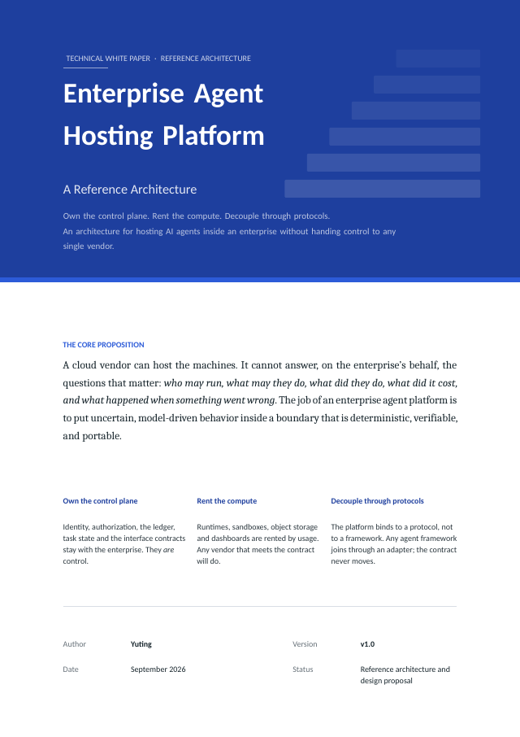
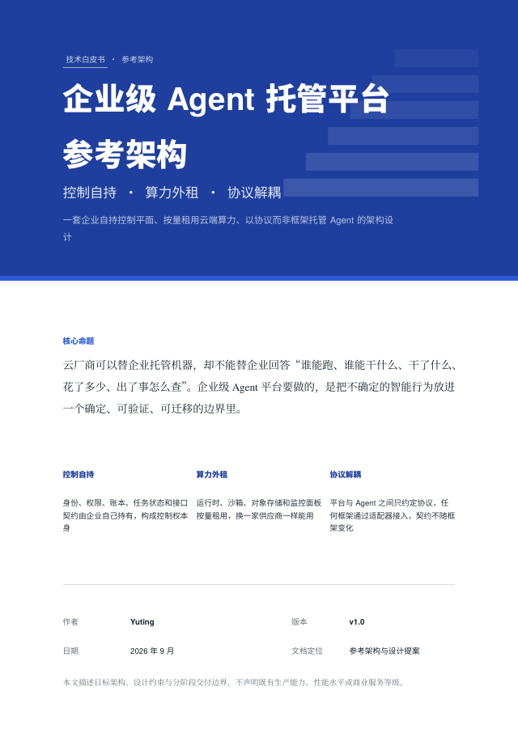
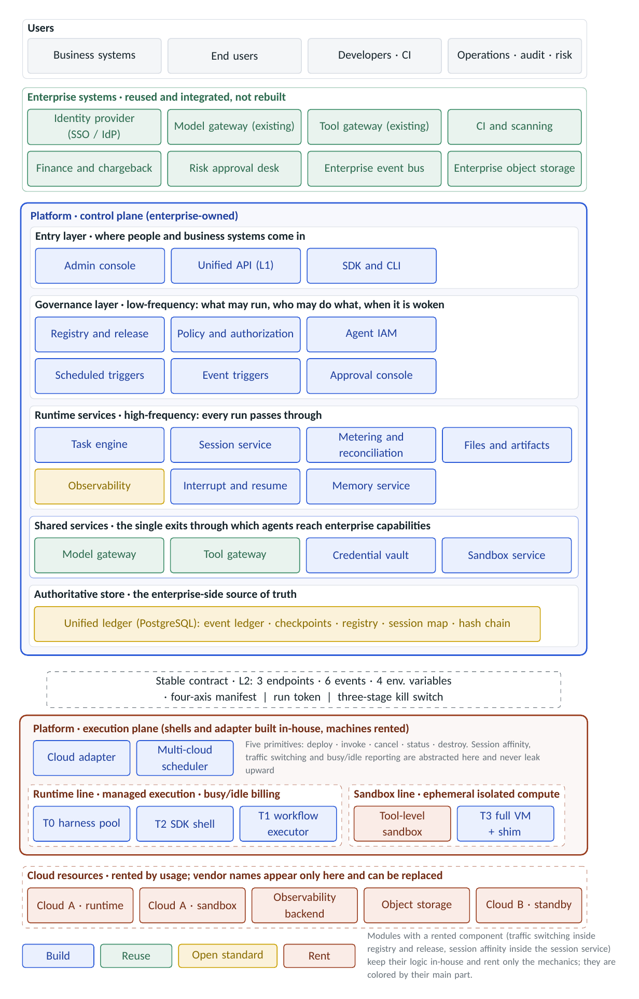
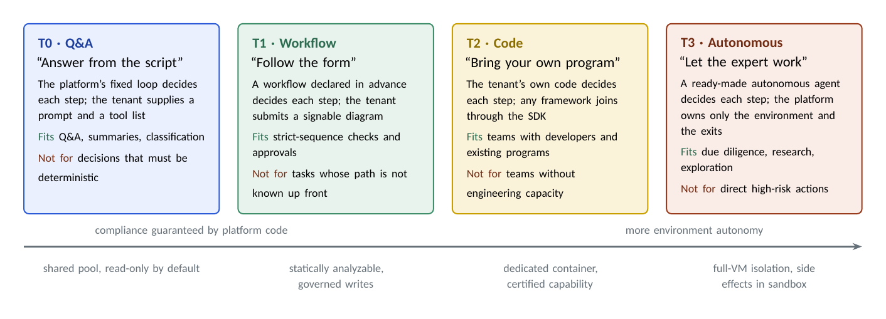

<div align="center">

# Enterprise Agent Hosting Platform

**A Reference Architecture**

Own the control plane · Rent the compute · Decouple through protocols

[](pdf/enterprise-agent-hosting-platform.en.pdf)
[](pdf/enterprise-agent-hosting-platform.zh-CN.pdf)
[](CHANGELOG.md)
[](LICENSE)

**English** · [简体中文](README.zh-CN.md)

</div>

A cloud vendor can host the machines. It cannot answer, on the enterprise's behalf, the questions that decide whether an AI agent may go to production: **who may run, what may they do, what did they do, what did it cost, and what happened when something went wrong.**

This white paper proposes an architecture that keeps those answers inside the enterprise. The enterprise owns the control plane—identity, authorization, the ledger, task state and the interface contracts—and rents machines, sandboxes and storage by usage. The platform binds to a protocol rather than to any agent framework. Every action an agent takes against the outside world passes through an exit the platform can record and refuse, and every fact about a run is written to a ledger the enterprise holds.

## Read the paper

<table>
  <tr>
    <td align="center" width="50%">
      <a href="pdf/enterprise-agent-hosting-platform.en.pdf"></a><br>
      <b>English</b> · 59 pages<br>
      <a href="pdf/enterprise-agent-hosting-platform.en.pdf">PDF</a> · <a href="paper/en">LaTeX source</a>
    </td>
    <td align="center" width="50%">
      <a href="pdf/enterprise-agent-hosting-platform.zh-CN.pdf"></a><br>
      <b>简体中文</b> · 52 pages<br>
      <a href="pdf/enterprise-agent-hosting-platform.zh-CN.pdf">PDF</a> · <a href="paper/zh-CN">LaTeX source</a>
    </td>
  </tr>
</table>

The two editions carry the same content. The English edition was written for English readers rather than translated line by line.

## The argument in three ideas

1. **Put uncertain behavior inside a deterministic boundary.** A model's output cannot be predicted. What an agent can reach, what it may do, and where its actions are recorded can be. Governance targets the boundary, not the model.
2. **Control comes from authoritative state and governed exits.** Whoever holds the record of what really happened, and whoever guards the exits every action must pass, has control. Compute, sandboxes and dashboards carry no control and can be rented.
3. **Bind to a protocol, not to a framework.** Agent frameworks keep changing. The platform freezes one minimal container contract, and any framework joins through an adapter.

The second idea yields one procurement rule: **rent the muscle, never the brain or the keys.** A cloud component may be rented only if it holds no decision rights, hosts none of the enterprise's authoritative data, and follows a standard that makes leaving cheap.

## The architecture at a glance

<p align="center">
  
</p>

Read the figure from top to bottom.

- **Users.** Business systems, end users, developers, and operations, audit and risk staff each enter through their own entrance.
- **Enterprise systems.** What the company already runs—the identity provider, model and tool gateways, CI, finance and the event bus—is integrated, not rebuilt.
- **Control plane**, owned by the enterprise, in five partitions: the *entry layer* (console, unified API, SDK); the *governance layer* (registry and release, policy, agent identity, triggers, approval); *runtime services* (task engine, sessions, metering, artifacts, observability, interrupt and resume, memory); *shared services* (the model gateway, tool gateway, credential vault and sandbox service that every agent action must pass); and the *authoritative store*.
- **Stable contract.** A minimal container contract, frozen on day one, separates the control plane from the execution plane.
- **Execution plane.** The platform's shells and cloud adapter run on rented machines.
- **Cloud resources.** Rented by usage. Vendor names appear only in this bottom layer.

Colors show how each module is built: blue in-house, green reused from existing enterprise systems, yellow open standard, orange rented.

## Four kinds of agent

<p align="center">
  
</p>

Agents are divided by a single question: **who decides the next step?** The split does not depend on model strength or risk level, which is why it covers every case.

| Kind | Who decides the next step | Fits | Not for |
|---|---|---|---|
| **T0 · Q&A**<br>*answer from the script* | The platform's fixed loop; the tenant supplies a prompt and a tool list | Service desks, summaries, classification | Anything that must be deterministic |
| **T1 · Workflow**<br>*follow the form* | A workflow drawn in advance and signed off | Strict-sequence checks, approvals, reporting | Tasks whose path is not known up front |
| **T2 · Code**<br>*bring your own program* | The tenant's own code, in any framework | Teams with developers and existing programs | Teams without engineering capacity |
| **T3 · Autonomous**<br>*let the expert work* | A ready-made autonomous agent in a fully isolated environment | Due diligence, research, exploration | Executing high-risk actions directly |

T0 to T3 is not a ladder from basic to advanced. The higher the risk, the more a process should converge on a signed workflow rather than reach for more autonomy.

## Ten invariants

The design is judged by constraints that no implementation may violate. The paper gives a verification method for each one.

1. No long-lived secret ever exists inside a container.
2. Side effects pass only through the governed exits.
3. Tool calls are authoritative only as recorded by the tool gateway.
4. The ledger stays inside the enterprise boundary, append-only and hash-chained.
5. Every run has a hard ceiling on steps, calls, model usage, duration and spend.
6. Tokens are separated by interface: a run token cannot reach the management API, and a platform token cannot reach the runtime exits.
7. User identity is verified against the identity provider, never taken on trust.
8. Shutting an agent down does not depend on the cloud vendor.
9. Event sequence numbers are assigned by the platform and recorded before delivery.
10. Administrative actions and agent actions share one ledger.

## What's inside

| Part | Topics |
|---|---|
| **I. The case and the object** | Why the platform must exist, what counts as a hostable agent, the four kinds and how to choose, principles and invariants, related work |
| **II. Architecture and runtime contract** | The complete architecture, the four-axis capability manifest and admission, three interface layers, one request end to end, runtime semantics, circuit breaker, idempotency, recovery and the three-stage kill switch, how each kind fulfills the contract |
| **III. Security, governance and runtime control** | Threat model, identity and authorization, the governed exits, the unified ledger and metering, the authoritative store, the boundary with cloud vendors |
| **IV. Productization, delivery and evolution** | Enterprise integration, kernel and policy packs, phased delivery and six acceptance loops, key decisions, residual risks |
| **Appendices** | Glossary, container contract quick reference, ten-invariant acceptance checklist |

24 figures and 32 tables in each edition.

## Scope

This is a reference architecture and a design proposal. It describes a target architecture, the constraints it must satisfy and a phased delivery boundary. It is not an implementation report, and it contains no measured performance figures or service-level claims.

The paper builds on patterns the industry has converged on—managed runtimes, workload identity, credential vaults, gateways, sandboxes, durable execution—and credits the prior work it relies on. Its focus is the enterprise-side contracts and mechanisms that turn those pieces into one platform the enterprise can control, audit and move between vendors.

## Building from source

```text
paper/
├── en/            English edition: main.tex + sections/
└── zh-CN/         Simplified Chinese edition: main.tex + sections/
pdf/               Compiled PDFs
assets/            Images used in this README
Makefile           Build script
```

Each edition is split by part under `sections/` (preamble, front matter, Parts I–IV, appendices, references) and typeset with XeLaTeX. On Ubuntu 24.04:

```bash
sudo apt-get install make texlive-xetex texlive-latex-base texlive-latex-recommended \
  texlive-latex-extra texlive-pictures texlive-lang-chinese texlive-lang-cjk \
  fonts-crosextra-caladea fonts-crosextra-carlito fonts-dejavu-mono fonts-lmodern \
  fonts-texgyre fonts-noto-cjk fonts-noto-cjk-extra

make            # build both editions into build/
make en         # English only
make zh-CN      # Simplified Chinese only
make release    # build, then copy the PDFs into pdf/
```

The English edition uses Caladea, Carlito, DejaVu Sans Mono and Latin Modern Math; the Chinese edition uses Noto Serif CJK SC, Noto Sans CJK SC and TeX Gyre Termes, Heros and Cursor. The GitHub Actions workflow in `.github/workflows/build.yml` runs the same build on every change to the sources and publishes both PDFs as a release when a version tag is pushed.

## Citation

If this work informs yours, please cite it. The **Cite this repository** button in the sidebar reads [`CITATION.cff`](CITATION.cff).

```bibtex
@misc{yuting2026agenthosting,
  author       = {Yuting},
  title        = {Enterprise Agent Hosting Platform: A Reference Architecture},
  howpublished = {Technical white paper, version 1.0},
  year         = {2026},
  month        = sep,
  url          = {https://github.com/YOUR_GITHUB_USERNAME/enterprise-agent-hosting-platform}
}
```

## License

Copyright © 2026 Yuting. The text, figures and LaTeX source are licensed under [Creative Commons Attribution 4.0 International](LICENSE). You may share and adapt the material for any purpose, including commercially, provided you give appropriate credit, link to the license and indicate whether changes were made.

## Author

**Yuting**

Questions, corrections and critique are welcome. Please open an [issue](../../issues).
