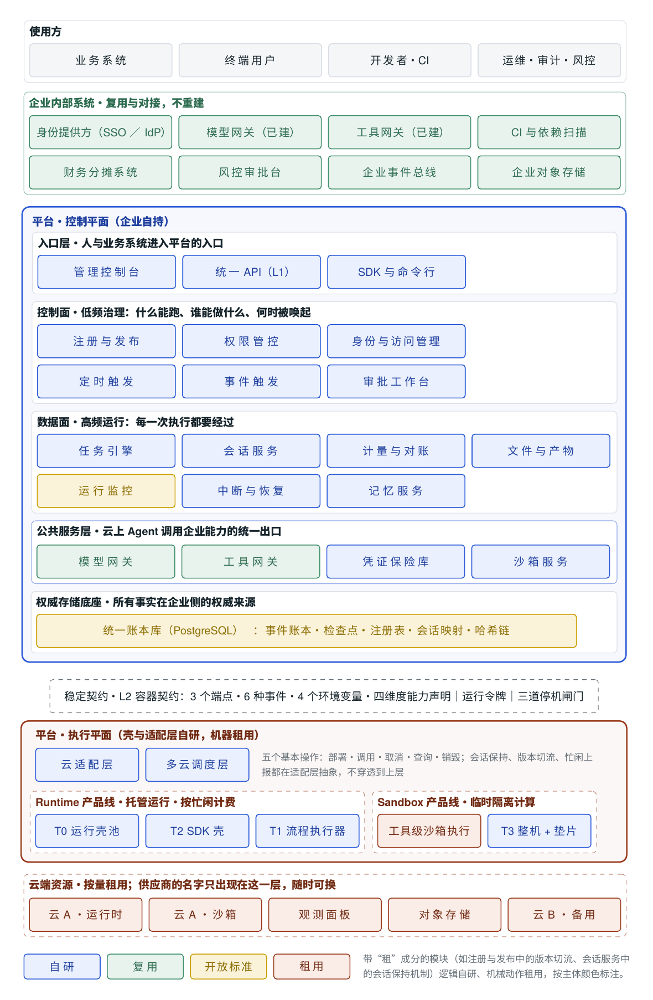
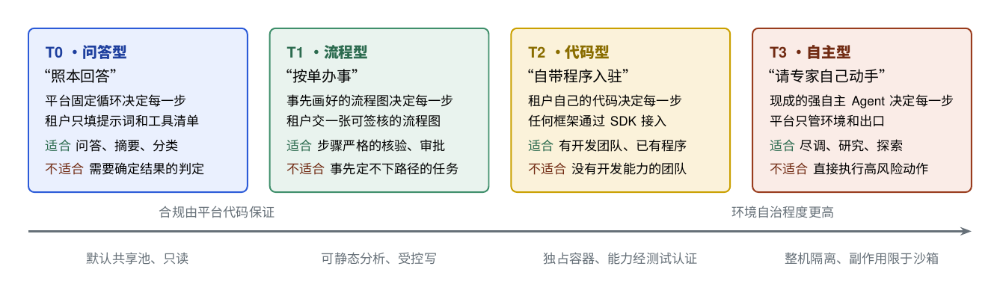

<div align="center">

# 企业级 Agent 托管平台参考架构

控制自持 · 算力外租 · 协议解耦

[](pdf/enterprise-agent-hosting-platform.zh-CN.pdf)
[](pdf/enterprise-agent-hosting-platform.en.pdf)
[](CHANGELOG.md)
[](LICENSE)

[English](README.md) · **简体中文**

</div>

云厂商可以替企业托管机器，却不能替企业回答决定一个 AI Agent 能否进入生产的那几个问题：**谁能跑、谁能干什么、干了什么、花了多少、出了事怎么查。**

这份白皮书给出一套把这些答案留在企业手里的架构：企业自己持有控制平面——身份、权限、账本、任务状态和接口契约——机器、沙箱和存储按量租用；平台与 Agent 之间只约定协议，不绑定任何开发框架；Agent 对外部世界的每一次操作，都经过平台能记录、能拒绝的出口；每次执行的全部事实，都记入企业自己的账本。

## 阅读白皮书

<table>
  <tr>
    <td align="center" width="50%">
      <a href="pdf/enterprise-agent-hosting-platform.zh-CN.pdf"></a><br>
      <b>简体中文</b> · 52 页<br>
      <a href="pdf/enterprise-agent-hosting-platform.zh-CN.pdf">PDF</a> · <a href="paper/zh-CN">LaTeX 源码</a>
    </td>
    <td align="center" width="50%">
      <a href="pdf/enterprise-agent-hosting-platform.en.pdf"></a><br>
      <b>English</b> · 59 页<br>
      <a href="pdf/enterprise-agent-hosting-platform.en.pdf">PDF</a> · <a href="paper/en">LaTeX 源码</a>
    </td>
  </tr>
</table>

两个版本内容一致。英文版是按英文读者的阅读习惯重写的，不是逐句翻译。

## 三个设计理念

1. **把不确定的行为放进确定的边界。** 模型的输出无法预测，但 Agent 能接触到什么、能做什么、做了什么被记在哪里，这些是确定的。治理的对象是边界，不是模型。
2. **控制权来自权威状态和关键出口。** 谁掌握“真实发生过什么”的记录、谁守着每次行动必经的出口，谁就有控制权。算力、沙箱、监控面板不带控制权，可以租。
3. **绑定协议，不绑定框架。** Agent 的开发框架会不断更迭。平台只冻结一份最小的容器契约，任何框架通过适配器接入。

由第二条推出一条采购规则：**租力气，不租脑子和钥匙。** 一个云组件只有同时满足三个条件才能租：不握决定权、不托管企业的权威数据、有行业标准可以低成本退出。

## 总体架构

<p align="center">
  
</p>

这张图从上往下读：

- **使用方。** 业务系统、终端用户、开发者，以及运维、审计和风控人员，各走各的入口。
- **企业内部系统。** 企业已经在用的身份提供方、模型网关、工具网关、CI、财务系统和事件总线，直接对接，不重建。
- **控制平面**，由企业持有，分五个区：*入口层*（控制台、统一 API、SDK）；*控制面*（注册与发布、权限、身份、触发、审批）；*数据面*（任务引擎、会话、计量、产物、监控、中断与恢复、记忆）；*公共服务层*（每个 Agent 动作都必须经过的模型网关、工具网关、凭证保险库和沙箱服务）；*权威存储底座*。
- **稳定契约。** 一份第一天就冻结的最小容器契约，把控制平面和执行平面隔开。
- **执行平面。** 平台的运行壳和云适配层跑在租来的机器上。
- **云端资源。** 按量租用。供应商的名字只出现在最底下这一层。

颜色表示建设方式：蓝色自研，绿色复用企业已有系统，黄色开放标准，橙色租用。

## 四种 Agent

<p align="center">
  
</p>

四种形态只按一个问题划分：**下一步由谁决定？** 这个划分和模型强弱、风险高低都无关，所以能覆盖所有情况。

| 形态 | 下一步由谁决定 | 适合 | 不适合 |
|---|---|---|---|
| **T0 · 问答型**<br>照本回答 | 平台固定的循环；租户只填提示词和工具清单 | 客服问答、摘要、分类 | 需要确定结果的判定 |
| **T1 · 流程型**<br>按单办事 | 事先画好并签核的流程图 | 步骤严格的核验、审批、报表 | 事先定不下路径的任务 |
| **T2 · 代码型**<br>自带程序入驻 | 租户自己的代码，任何框架 | 有开发团队、已有程序的团队 | 没有开发能力的团队 |
| **T3 · 自主型**<br>请专家自己动手 | 现成的强自主 Agent，在完整的隔离环境里 | 尽调、研究、探索 | 直接执行高风险动作 |

T0 到 T3 不是从低级到高级。风险越高的业务，越应该收敛到签核过的流程图，而不是追求更高的自治。

## 十条不变量

判断这套设计是否成立，看的是任何实现都不能违反的约束。白皮书为每一条给出了验证方法。

1. 容器里永远没有长期密钥。
2. 副作用只走统一出口。
3. 工具调用以工具网关的记录为准。
4. 账本在企业边界内、只追加、带哈希链。
5. 每次执行在步数、调用次数、模型用量、时长、金额上都有硬上限。
6. 令牌按接口隔离：运行令牌碰不到管理接口，平台令牌碰不到运行侧出口。
7. 用户身份必须由身份提供方验签，不接受声明。
8. 停掉一个 Agent 不依赖云供应商。
9. 事件序号由平台分配，先记账再分发。
10. 管理动作与 Agent 动作记在同一本账。

## 内容结构

| 部分 | 主要内容 |
|---|---|
| **第一部分　命题与托管对象** | 平台为什么必须存在、什么算可托管的 Agent、四种形态与选型、设计原则与不变量、相关工作 |
| **第二部分　体系架构与运行契约** | 总体架构、四维度能力声明与准入、三层接口、一次调用的完整过程、运行时语义、熔断与幂等与恢复与三道停机闸门、四种形态怎么实现契约 |
| **第三部分　安全治理与运行控制** | 威胁模型、身份与权限、副作用的统一出口、统一账本与计量、权威存储底座、执行平面与云供应商边界 |
| **第四部分　产品化、交付与演进** | 企业系统对接、内核与策略包、分阶段交付与六个验收闭环、关键决策、残余风险 |
| **附录** | 术语表、容器契约速查、十条不变量验收清单 |

每个版本 24 张图、32 张表。

## 文档定位

这是一份参考架构和设计提案，描述目标架构、必须满足的约束和分阶段的交付边界。它不是实施结果报告，不包含任何实测性能数字或服务等级承诺。

白皮书建立在业界已经形成共识的做法之上——托管运行时、工作负载身份、凭证保管、网关、沙箱、持久执行——并注明了所依据的先例。它关注的是把这些能力组合成一个企业能控制、能审计、能在供应商之间迁移的平台所需要的那一组企业侧契约和机制。

## 从源码构建

```text
paper/
├── en/            英文版：main.tex + sections/
└── zh-CN/         中文版：main.tex + sections/
pdf/               编译好的 PDF
assets/            本页用到的图片
Makefile           构建脚本
```

每个版本在 `sections/` 下按部分拆开（导言区、前置页、第一至第四部分、附录、参考文献），用 XeLaTeX 排版。在 Ubuntu 24.04 上：

```bash
sudo apt-get install make texlive-xetex texlive-latex-base texlive-latex-recommended \
  texlive-latex-extra texlive-pictures texlive-lang-chinese texlive-lang-cjk \
  fonts-crosextra-caladea fonts-crosextra-carlito fonts-dejavu-mono fonts-lmodern \
  fonts-texgyre fonts-noto-cjk fonts-noto-cjk-extra

make            # 构建两个版本，输出到 build/
make zh-CN      # 只构建中文版
make en         # 只构建英文版
make release    # 构建后把 PDF 复制到 pdf/
```

中文版用思源宋体、思源黑体（Noto Serif/Sans CJK SC）和 TeX Gyre Termes、Heros、Cursor；英文版用 Caladea、Carlito、DejaVu Sans Mono 和 Latin Modern Math。`.github/workflows/build.yml` 里的 GitHub Actions 在源码每次改动时跑同样的构建，推送版本标签时自动发布附带两个 PDF 的 Release。

## 引用

如果这份白皮书对你的工作有帮助，欢迎引用。侧栏的 **Cite this repository** 按钮读取的是 [`CITATION.cff`](CITATION.cff)。

```bibtex
@misc{yuting2026agenthosting,
  author       = {Yuting},
  title        = {Enterprise Agent Hosting Platform: A Reference Architecture},
  howpublished = {Technical white paper, version 1.0},
  year         = {2026},
  month        = sep,
  url          = {https://github.com/zhangyuting/Enterprise-Agent-Hosting-Platform}
}
```

## 许可

版权所有 © 2026 Yuting。正文、图和 LaTeX 源码采用[知识共享署名 4.0 国际许可协议](LICENSE)（CC BY 4.0）。你可以为任何目的（包括商业用途）分享和改编这些材料，但须注明出处、附上许可协议链接，并说明是否做了修改。

## 作者

**Yuting**

欢迎提问、指正和批评，请在 [Issues](../../issues) 里留言。
